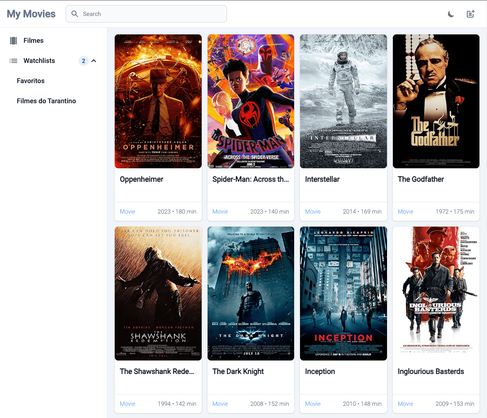
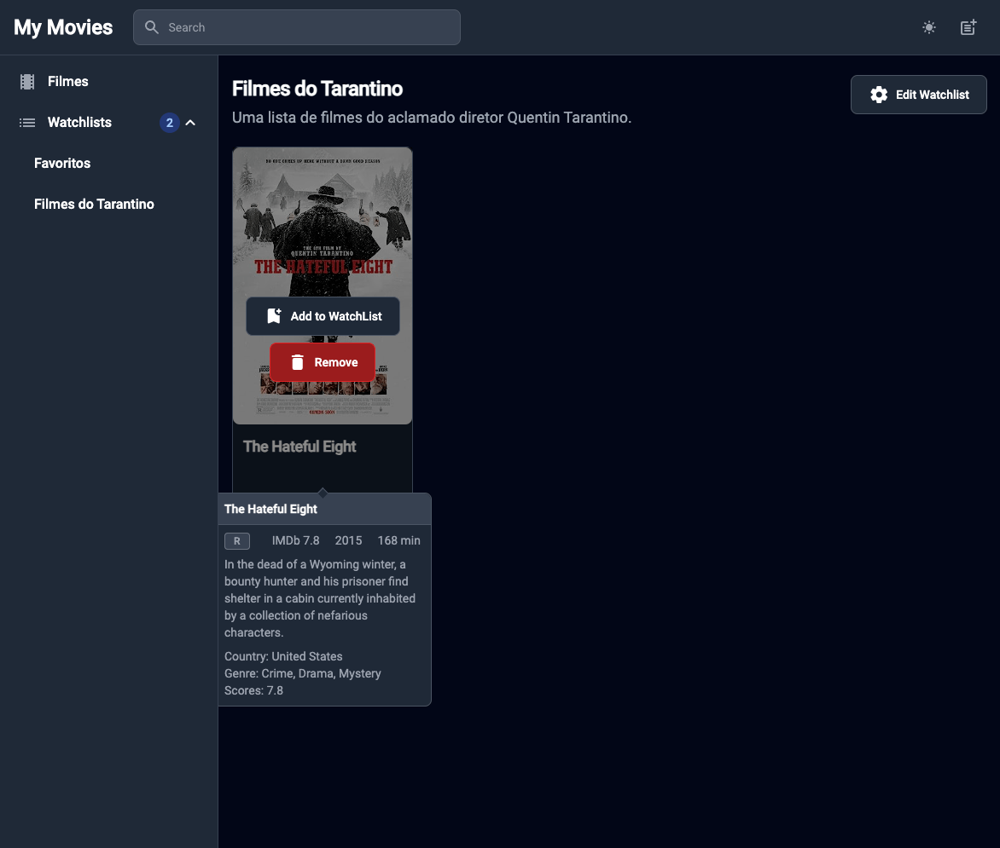
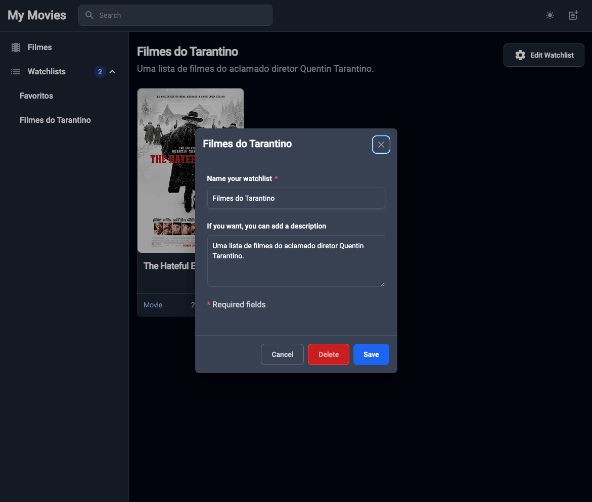
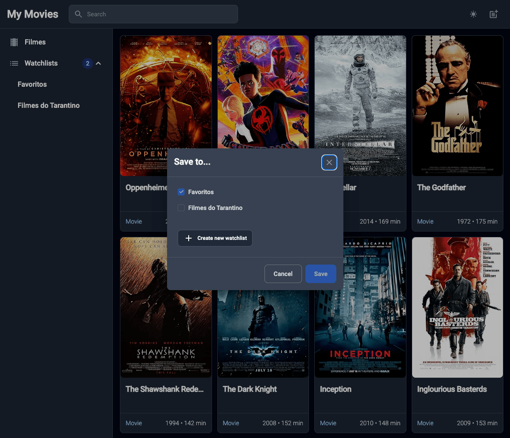
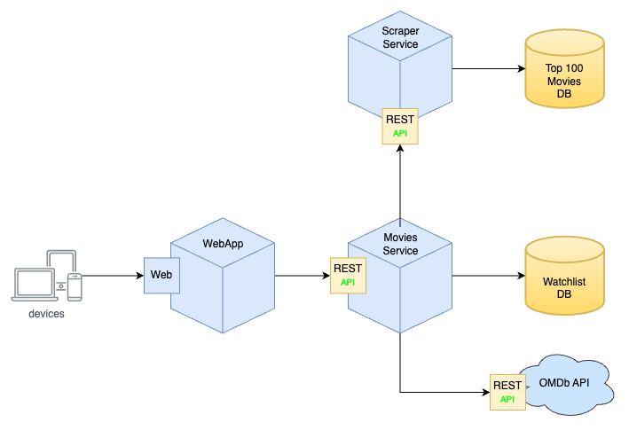

# My Movies - Frontend

Este projeto da uma interface de usuário desenvolvida com Angular e Tailwind em conjunto com
um backend desenvolvido com Flask e SQLAlchemy para site de gestão de lista de filmes para a matéria de
**Desenvolvimento Backend Avançado** do programa de pós-graduação em Desenvolvimento
Full Stack da [PUC-Rio](https://www.puc-rio.br/index.html).

## Features

- [x] Listar os filmes mais populares na IMDb
- [x] Buscar filmes por nome
- [x] Criar, editar e remover listas de filmes
- [x] Adicionar ou remover filmes de uma lista

## Screenshots

<div align="center">
  
  
</div>

<div style="clear: both; margin-bottom: 28px;"></div>

<div align="center" style="clear: both">
  
  
</div>

<div style="clear: both"></div>

---

## Technologias

As seguintes ferramentas foram usadas na construção do projeto:

- [Angular](https://angular.io/)
- [Tailwind](https://tailwindcss.com/)
- [Angular Material](https://material.angular.io/)
- [Flowbite](https://flowbite.com/angular/)
- [Docker](https://www.docker.com/)
- [Docker Compose](https://docs.docker.com/compose/)

## Como executar

### Pré-requisitos

Antes de começar, você vai precisar ter instalado em sua máquina as seguintes ferramentas:
[Git](https://git-scm.com), [Node.js](https://nodejs.org/en/).
Além disto é bom ter um editor para trabalhar com o código como [VSCode](https://code.visualstudio.com/)

### Rodando a aplicação

```bash
# 1 - Clone este repositório
$ git clone https://github.com/eliasmatheus/my-movies-frontend.git

# 2 - Acesse a pasta do projeto no terminal/cmd
$ cd my-movies-frontend

# 3 - Instale as dependências
$ npm install

# 4 - Execute a aplicação em modo de desenvolvimento
$ npm run start

# A aplicação inciará na porta:4200 - acesse <http://localhost:4200/>
```

Abra o [http://localhost:4200/](http://localhost:4200/) para acessar a aplicação.

#### Como executar através do Docker

Certifique-se de ter o [Docker](https://docs.docker.com/engine/install/) instalado e em execução em sua máquina.

Após seguir os passos 1 e 2 da sessão [Rodando a aplicação](#rodando-a-aplicação), execute o seguinte comando:

```bash
$ docker-compose up
```

Acesse o [http://localhost:4200/](http://localhost:4200/) para acessar a aplicação.

### Rodando o backend

Para rodar o servidor, acesse o repositório do [backend](https://github.com/eliasmatheus/my-movies-api.git) e siga as instruções.

Esta aplicação faz uso de um backend projetado com microserviços, de acordo com o diagrama abaixo:

<div align="center" style="clear: both">
  
</div>
